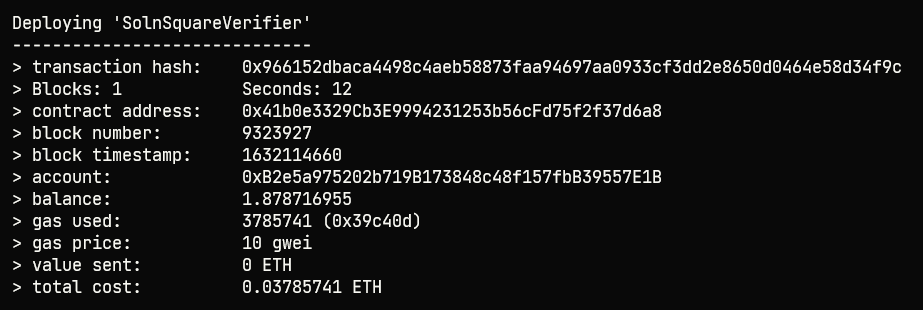
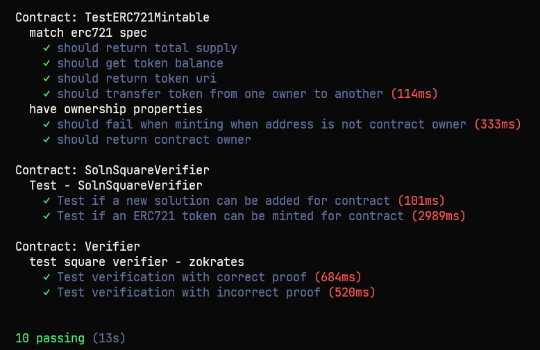

# Udacity Blockchain Capstone

The capstone will build upon the knowledge you have gained in the course in order to build a decentralized housing product. 

# Project Resources

* [Remix - Solidity IDE](https://remix.ethereum.org/)
* [Visual Studio Code](https://code.visualstudio.com/)
* [Truffle Framework](https://truffleframework.com/)
* [Ganache - One Click Blockchain](https://truffleframework.com/ganache)
* [Open Zeppelin ](https://openzeppelin.org/)
* [Interactive zero knowledge 3-colorability demonstration](http://web.mit.edu/~ezyang/Public/graph/svg.html)
* [Docker](https://docs.docker.com/install/)
* [ZoKrates](https://github.com/Zokrates/ZoKrates)


# Contract Details
- Name: GaleDot
- Symbol: GOT
- Base URL: https://s3-us-west-2.amazonaws.com/udacity-blockchain/capstone/
- OpenSea MarketPlace: https://testnets.opensea.io/collection/unidentified-contract-ggb7cocsnj
- Contract Address:
    * SolnSquareVerifier: 0x41b0e3329Cb3E9994231253b56cFd75f2f37d6a8
    * Verifier: 0xb343f3402eb7c04a454ebf876b104c4a636ffae6




# Tests


Start Truffle by running

```bash
# For starting the development console
truffle develop
# truffle console

# For compiling the contract, inside the development console, run:
truffle(develop)> compile

# For migrating the contract to the locally running Ethereum network, inside the development console
truffle(develop)> migrate --reset

# For running unit tests the contract, inside the development console, run:
truffle(develop)> test
```

# Open Sea Link